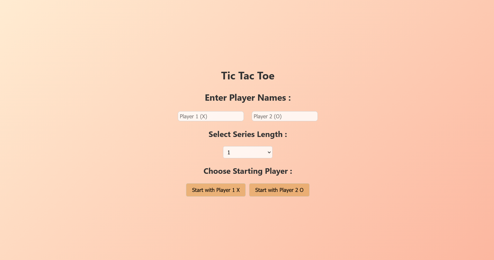
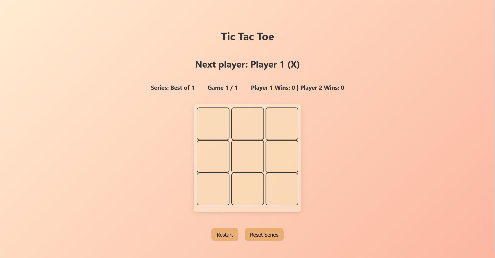

# 🎮 Tic Tac Toe Game (React)

A fully interactive Tic Tac Toe game built with **React**.
This game goes beyond the classic version by allowing players to:

* Enter their own names.
* Choose the series length (Best of 1, 3, 5, or 7).
* Decide which player starts first.
* Track wins across multiple games in the series.
* Reset the current game or the entire series anytime.

---

## 🚀 Features

* **Custom Player Names** – Players can input their own names instead of generic "X" and "O".
* **Series Mode** – Play best of 1, 3, 5, or 7 games. The first to reach the majority wins the series.
* **Dynamic Starting Player** – Choose whether Player X or Player O starts the game.
* **Scoreboard** – Displays current game number, total series length, and both players’ win counts.
* **Game Reset** – Restart the current board anytime without affecting the series score.
* **Series Reset** – Reset the entire series to start fresh.
* **Winner & Draw Detection** – Alerts the winner when the series is over, and handles draws correctly.

---

## 🛠️ Tech Stack

* **React** – For UI and state management.
* **JavaScript (ES6+)** – Core game logic.
* **CSS** – Styling and layout.

---

## 📂 Project Structure

```
src/
├── Board.jsx       # Main game logic and UI
├── SquareBox.jsx    # Individual square component
├── Board.css        # Styles for the game board
├── App.css         # Global styles
├── App.jsx         # Main App component
├── SquareBox.css   # Styles for individual squares
└── index.jsx       # App entry point
```

---

## ▶️ How to Run

1. Clone the repository:

   ```bash
   git clone https://github.com/aditya-6655kh/Tic-Tac-Toe.git
   cd Tic-Tac-Toe
   ```

2. Install dependencies:

```bash
   npm install
   ```
```bash
   npm install
   ```

3. Start the development server:

   ```bash
   npm run dev
   ```

---

## 🎯 Gameplay Example

1. Enter player names (e.g., Alice vs Bob).
2. Select series length (e.g., Best of 5).
3. Choose starting player.
4. Play Tic Tac Toe normally: players take turns placing **X** and **O**.
5. First to win majority of the series is declared **Series Champion**.

---

## 📸 Screenshots (Optional)

*Screenshots *



---

## 🔮 Future Improvements

* Add option for **single-player vs AI** mode.
* Track **match history**.
* Add **dark mode** styling.
* Make the game **mobile responsive**.

---

## 📜 License

This project is licensed under the **MIT License**.
Feel free to fork, improve, and share!

---

✨ Built with passion using React.
